# Document Management Service

A Spring Boot service for managing PDF documents with MinIO storage and PostgreSQL metadata management made by nescao(nestor alvarez).

## Features

- Upload PDF documents (up to 500MB)
- Search documents by user, name, and tags
- Download documents via temporary URLs
- Efficient memory management (50MB container limit)

## Prerequisites

- Docker and Docker Compose
- Java 17
- Maven

## Quick Start

1. Clone the repository
2. Create `.env` file in the docker directory similar like this one:

```env
POSTGRESQL_USERNAME=a
POSTGRESQL_PASSWORD=b
MINIO_ROOT_USER=d
MINIO_ROOT_PASSWORD=e
```

3. also you can edit the envExample file that is in the docker directory.

4. Go to your IDE settings and enable the values from the env
   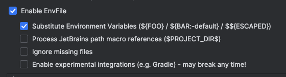

5. Start the application using Docker Compose:

```
docker-compose up --build
```

## API Usage

### Upload Document

```
curl -X POST http://localhost:8080/api/documents \
  -H "Content-Type: multipart/form-data" \
  -F "metadata={\"userId\":\"user1\",\"documentName\":\"sample.pdf\",\"tags\":[\"tag1\",\"tag2\"]}" \
  -F "file=@/path/to/your/file.pdf"
```
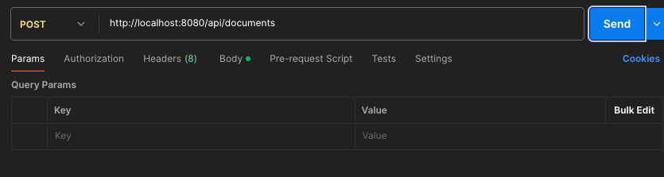

### Search Documents

```
# Search with filters
curl "http://localhost:8080/api/documents?userId=user1&documentName=sample&tags=tag1&page=0&size=10"

# Get all documents
curl "http://localhost:8080/api/documents?page=0&size=10"

```
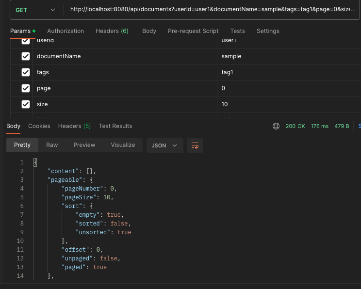
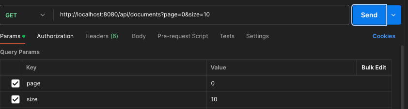

### Download Document

```
# Get temporary download URL
curl http://localhost:8080/api/documents/{documentId}/download

```
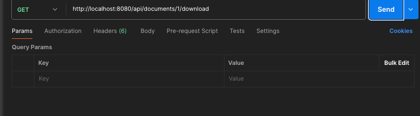

## Available Services

- Document Management Service: http://localhost:8080 and the Method that you can consume(more info in swagger)
- MinIO Console: http://localhost:9001
- 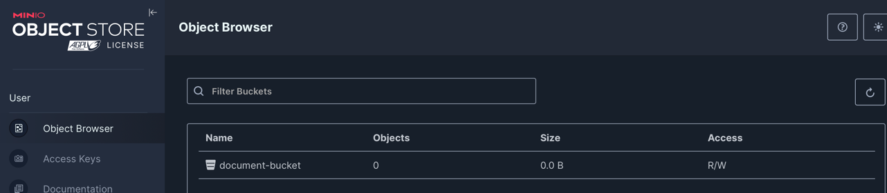
- MinIO API: http://localhost:9000
- PostgreSQL: localhost:5432
- 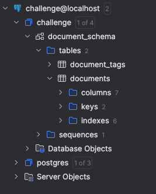
- Apidocs: http://localhost:8080/v3/api-docs
- 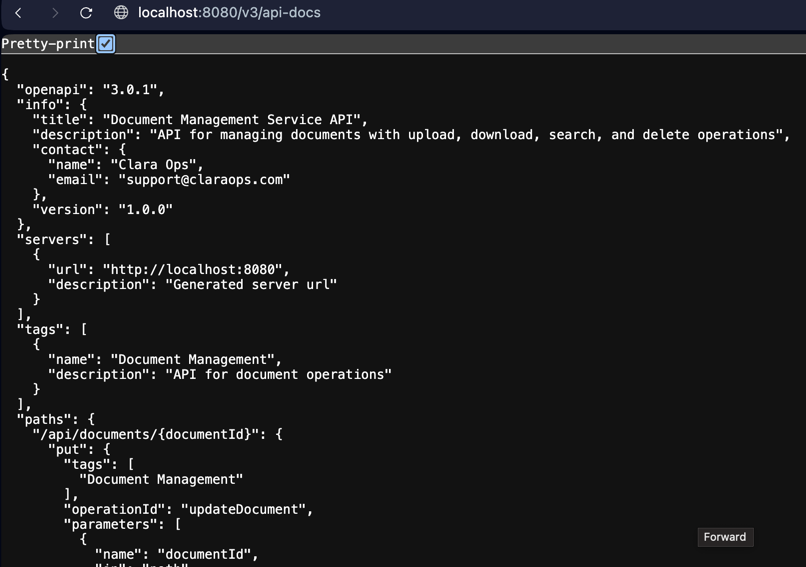
- Swagger: http://localhost:8080/swagger-ui/index.html#/
- 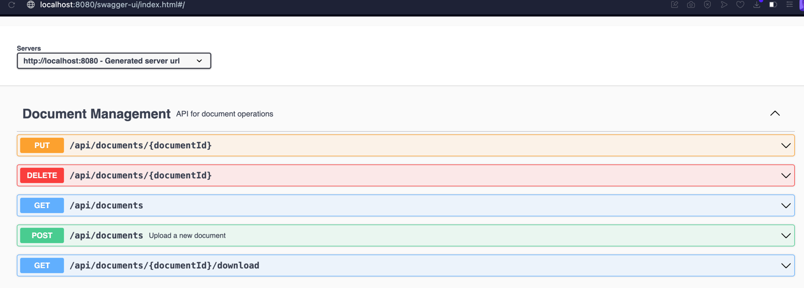

## Testing and Code Quality

Run tests and generate coverage report with this command:
./mvnw clean test jacoco:report
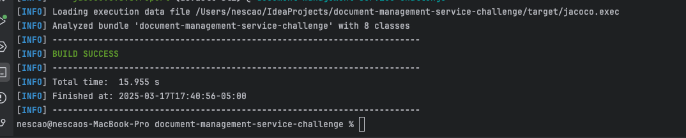

Run the spotless add-on to ident the application
./mvnw spotless:apply
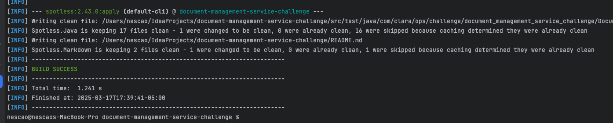

## Architecture

This service follows a hexagonal architecture pattern as required in the Test description:

- Domain layer: Core business logic and interfaces
- Infrastructure layer: Config persistence rest and storage
- Exception layer: Service exceptions for the expected errors

## Integrated Tools

- Spring Boot: Pre-configured application framework by the test
- Spring Data JPA: Database operations
- MinIO: Object storage for documents
- Lombok: Reducing boilerplate code
- JUnit 5: Unit and integration testing
- Mockito: Mocking dependencies in tests
- AssertJ: Fluent assertions in tests
- Jacoco: Code coverage reporting
- Spotless: Code formatting

